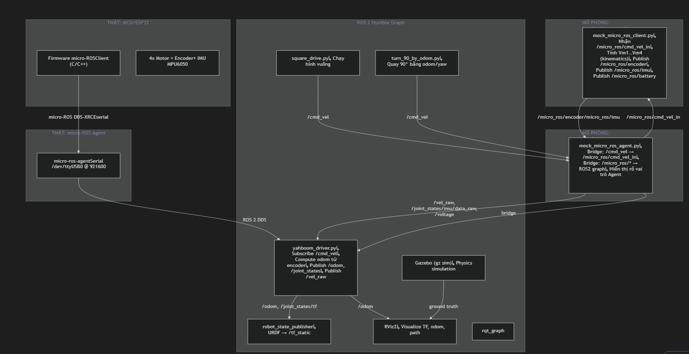

Mô tả tổng quan
Xây dựng một workspace ROS 2 Humble hoàn chỉnh để mô phỏng kiến trúc hệ thống xe robot Yahboom 4 bánh dùng micro-ROS, chạy hoàn toàn trên PC Ubuntu/VSCode, không cần phần cứng thật.

Cấu trúc thư mục dự án
~/ros2_ws/
├── src/
│   ├── yahboom_description/          # URDF/xacro robot model
│   │   ├── package.xml
│   │   ├── CMakeLists.txt
│   │   ├── urdf/
│   │   │   └── yahboom_car.urdf.xacro
│   │   ├── meshes/                   # (tùy chọn)
│   │   └── rviz/
│   │       └── yahboom.rviz
│   │
│   ├── yahboom_gazebo/               # Gazebo world + spawn
│   │   ├── package.xml
│   │   ├── CMakeLists.txt
│   │   ├── worlds/
│   │   │   └── empty_world.world
│   │   └── launch/
│   │       └── gazebo.launch.py
│   │
│   ├── mock_micro_ros/               # Giả lập micro-ROS layer
│   │   ├── package.xml
│   │   ├── setup.py
│   │   ├── mock_micro_ros/
│   │   │   ├── __init__.py
│   │   │   ├── mock_client.py        # Giả lập ESP32/MCU firmware
│   │   │   └── mock_agent.py         # Giả lập micro-ROS Agent
│   │   └── launch/
│   │       └── mock_micro_ros.launch.py
│   │
│   ├── yahboom_driver/               # ROS 2 driver (thay Rosmaster_Lib)
│   │   ├── package.xml
│   │   ├── setup.py
│   │   ├── yahboom_driver/
│   │   │   ├── __init__.py
│   │   │   └── driver_node.py
│   │   └── config/
│   │       └── driver_params.yaml
│   │
│   ├── yahboom_nav/                  # Navigation nodes
│   │   ├── package.xml
│   │   ├── setup.py
│   │   ├── yahboom_nav/
│   │   │   ├── __init__.py
│   │   │   ├── square_drive.py       # Đi hình vuông
│   │   │   └── turn_90_by_odom.py    # Quay 90° dùng odom
│   │   └── launch/
│   │       └── nav_demo.launch.py
│   │
│   └── yahboom_bringup/              # Launch tổng
│       ├── package.xml
│       ├── CMakeLists.txt
│       ├── launch/
│       │   ├── sim_complete.launch.py   # Launch file tổng
│       │   └── robot_bringup.launch.py
│       └── config/
│           └── sim_params.yaml
│
└── README.md
Chi tiết các thành phần
1. yahboom_description — URDF/Xacro
[NEW] urdf/yahboom_car.urdf.xacro
URDF đầy đủ của xe 4 bánh:

base_link (chassis box)
4 wheel_*_link gắn qua continuous joints
imu_link frame
laser_link frame (dự phòng cho rplidar)
plugins Gazebo: libgazebo_ros_diff_drive hoặc skid steer
plugin IMU giả lập
[NEW] rviz/yahboom.rviz
Config RViz2 hiện: TF, RobotModel, Odometry, Path, IMU

2. mock_micro_ros — Trái tim mô phỏng
[NEW] mock_micro_ros/mock_client.py
Giả lập firmware ESP32 / micro-ROS client:

Subscribe /micro_ros/cmd_vel_in (geometry_msgs/Twist)
Tính tốc độ 4 bánh: Vm1=Vm2=Vx-Vz*(A+B), Vm3=Vm4=Vx+Vz*(A+B)
Tích phân kinematics → encoder ticks giả lập
Publish /micro_ros/encoder (custom hoặc JointState)
Publish /micro_ros/imu (sensor_msgs/Imu) với noise giả lập
Publish /micro_ros/battery (std_msgs/Float32)
Config: wheel_radius, wheel_separation, ticks_per_rev
[NEW] mock_micro_ros/mock_agent.py
Giả lập micro-ROS Agent (bridge):

Subscribe /cmd_vel → republish /micro_ros/cmd_vel_in
Subscribe /micro_ros/encoder → republish /vel_raw, /joint_states
Subscribe /micro_ros/imu → republish /imu/data_raw
Subscribe /micro_ros/battery → republish /voltage
Log rõ ràng mỗi khi bridge tin nhắn (để học luồng dữ liệu)
3. yahboom_driver — Driver ROS 2
[NEW] yahboom_driver/driver_node.py
Thay thế Rosmaster_Lib driver thật:

Subscribe /cmd_vel
Subscribe /joint_states (từ agent)
Tính odometry từ wheel velocities
Publish /odom (nav_msgs/Odometry) + TF odom→base_link
Publish /vel_raw (custom hoặc Float32MultiArray)
Broadcast TF
4. yahboom_nav — Navigation demos
[NEW] yahboom_nav/square_drive.py
Publish /cmd_vel theo sequence: tiến → quay → tiến → quay → ...
Dựa trên thời gian (đơn giản, để so sánh)
[NEW] yahboom_nav/turn_90_by_odom.py
Subscribe /odom lấy yaw hiện tại
Publish /cmd_vel điều chỉnh đến khi yaw tăng đúng 90°
Feedback loop với tolerance
5. yahboom_bringup — Launch tổng
[NEW] launch/sim_complete.launch.py
Khởi động theo thứ tự:

Gazebo + world
robot_state_publisher với URDF
mock_micro_ros_client
mock_micro_ros_agent
yahboom_driver
RViz2 với config
rqt_graph (tùy chọn)
Topics và luồng dữ liệu
Topic	Type	Publisher	Subscriber	Ý nghĩa
/cmd_vel	Twist	square_drive / teleop	mock_agent	Lệnh điều khiển cấp cao
/micro_ros/cmd_vel_in	Twist	mock_agent	mock_client	Sau khi qua "Agent"
/micro_ros/encoder	JointState	mock_client	mock_agent	Encoder 4 bánh
/micro_ros/imu	Imu	mock_client	mock_agent	IMU data thô
/micro_ros/battery	Float32	mock_client	mock_agent	Điện áp giả lập
/vel_raw	Float32MultiArray	mock_agent/driver	(monitor)	Tốc độ bánh raw
/joint_states	JointState	mock_agent/driver	robot_state_publisher	Trạng thái khớp
/imu/data_raw	Imu	mock_agent	driver	IMU sau Agent
/odom	Odometry	driver	RViz2, nav nodes	Odometry tích phân
/tf	TF	driver, RSP	RViz2	Transform tree
/voltage	Float32	mock_agent	(monitor)	Pin
Phần không thể mô phỏng y hệt phần cứng
Phần cứng thật	Mô phỏng thay thế	Khác biệt
micro-ROS DDS-XRCE qua serial	ROS 2 topics thông thường	Không có overhead serial, không có XRCE protocol
ESP32 firmware C/C++	Python node	Logic tương đương nhưng không real-time
Encoder vật lý (quadrature)	Tích phân từ lệnh vận tốc	Không có slip, noise tối thiểu
IMU MPU6050 thật	Noise Gaussian giả lập	Không có drift thật, không có nhiễu từ rung động
Motor PID thật	Bỏ qua, dùng kinematics lý tưởng	Không có inertia, lag
Gazebo physics	Mô phỏng vật lý gần đúng	Sát thực tế hơn mock_client thuần túy
Kế hoạch thực thi
Bước 1: Tạo workspace và packages
ros2_ws/src/ với 5 packages
Viết package.xml, setup.py, CMakeLists.txt
Bước 2: URDF/Xacro
Viết URDF đầy đủ cho xe 4 bánh
Test với robot_state_publisher + RViz2
Bước 3: mock_micro_ros
Viết mock_client.py (kinematics + encoder/IMU giả lập)
Viết mock_agent.py (bridge + logging)
Bước 4: yahboom_driver
Viết driver_node.py (odom, TF, vel_raw)
Bước 5: yahboom_nav
Viết square_drive.py
Viết turn_90_by_odom.py
Bước 6: Launch files + RViz config
Viết sim_complete.launch.py
Tạo yahboom.rviz
Bước 7: README + hướng dẫn
Cài dependency
Build, source, launch
Test từng bước
Verification Plan
Automated checks
bash
# Build
colcon build --symlink-install
# Check packages
ros2 pkg list | grep yahboom
# Echo topics
ros2 topic echo /cmd_vel
ros2 topic echo /micro_ros/encoder
ros2 topic echo /odom
Manual verification
Launch Gazebo + RViz2, robot hiện đúng model
Publish /cmd_vel thủ công, robot di chuyển
Echo /micro_ros/encoder thấy giá trị thay đổi
TF tree đầy đủ: map → odom → base_link → wheel_*
Chạy square_drive.py, robot đi hình vuông
Chạy turn_90_by_odom.py, robot quay đúng 90°
rqt_graph hiện đủ tất cả nodes và topics